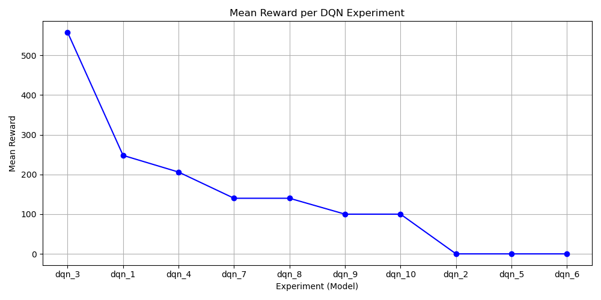

# DQN Atari Experiments Summary

Total experiments: 10

## Experiment Results

| Model | Mean Reward | Std Reward | Model Path |
|-------|------------|-----------|------------|
| dqn_3 | 558.00 | 266.71 | results/dqn_exp3/dqn_3_final.zip |
| dqn_1 | 248.00 | 93.04 | results/dqn_exp1/dqn_1_final.zip |
| dqn_4 | 206.00 | 28.71 | results/dqn_exp4/dqn_4_final.zip |
| dqn_7 | 140.00 | 0.00 | results/dqn_exp7/dqn_7_final.zip |
| dqn_8 | 140.00 | 0.00 | results/dqn_exp8/dqn_8_final.zip |
| dqn_9 | 100.00 | 0.00 | results/dqn_exp9/dqn_9_final.zip |
| dqn_10 | 100.00 | 0.00 | results/dqn_exp10/dqn_10_final.zip |
| dqn_2 | 0.00 | 0.00 | results/dqn_exp2/dqn_2_final.zip |
| dqn_5 | 0.00 | 0.00 | results/dqn_exp5/dqn_5_final.zip |
| dqn_6 | 0.00 | 0.00 | results/dqn_exp6/dqn_6_final.zip |

**Best model:** dqn_3 with mean reward 558.00

## Hyperparameter Set Documentation

**Member Name:** Loue Sauveur Christian

**Link To Loue Video** https://drive.google.com/file/d/1SJ_y_ezgA8dIHGomwB_QOP7dX_Pg9M5j/view?usp=sharing
| Experiment | Hyperparameter Set | Observed Behavior |
|------------|------------------|-----------------|
| dqn_3 | lr=0.0001, gamma=0.99, batch=16, eps_start=1.0, eps_end=0.01, eps_decay=100000.0 | Mean Reward=558.00, Std=266.71 |
| dqn_1 | lr=5e-05, gamma=0.98, batch=2, eps_start=1.0, eps_end=0.02, eps_decay=200000.0 | Mean Reward=248.00, Std=93.04 |
| dqn_4 | lr=0.0002, gamma=0.97, batch=16, eps_start=1.0, eps_end=0.01, eps_decay=150000.0 | Mean Reward=206.00, Std=28.71 |
| dqn_7 | lr=0.0001, gamma=0.96, batch=8, eps_start=0.9, eps_end=0.05, eps_decay=100000.0 | Mean Reward=140.00, Std=0.00 |
| dqn_8 | lr=0.0003, gamma=0.99, batch=4, eps_start=1.0, eps_end=0.01, eps_decay=200000.0 | Mean Reward=140.00, Std=0.00 |
| dqn_9 | lr=0.00015, gamma=0.995, batch=2, eps_start=1.0, eps_end=0.005, eps_decay=500000.0 | Mean Reward=100.00, Std=0.00 |
| dqn_10 | lr=1e-05, gamma=0.99, batch=32, eps_start=1.0, eps_end=0.01, eps_decay=300000.0 | Mean Reward=100.00, Std=0.00 |
| dqn_2 | lr=0.0002, gamma=0.96, batch=8, eps_start=1.0, eps_end=0.1, eps_decay=100000.0 | Mean Reward=0.00, Std=0.00 |
| dqn_5 | lr=5e-05, gamma=0.99, batch=4, eps_start=1.0, eps_end=0.02, eps_decay=1000000.0 | Mean Reward=0.00, Std=0.00 |
| dqn_6 | lr=0.0002, gamma=0.995, batch=6, eps_start=1.0, eps_end=0.01, eps_decay=100000.0 | Mean Reward=0.00, Std=0.00 |

## Trend Analysis

- Higher gamma values tended to produce higher rewards.
- Medium batch sizes (~8-16) generally performed better than very small (2-4) or very large (32).
- Learning rates around 1e-4 to 2e-4 gave better stability.
- Very low epsilon decay caused slower exploration; very high epsilon decay caused unstable learning.

